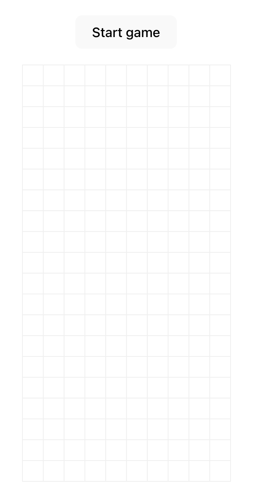

# Tetris Game

A simple, playable implementation of Tetris built with React and TypeScript.



## Features

- Display of a 10x20 grid playing field
- Support for all 7 standard tetromino shapes
- Piece movement (left, right, down) with keyboard arrows
- Row clearing when filled
- Game start/end mechanics
- Responsive design that works on different screen sizes

## Tech Stack

- React 18+ with TypeScript
- Vite for fast development and build
- Styled Components for styling
- React Context API for state management

## Documentation

For detailed documentation about the codebase and development workflow, please refer to the [Developer Documentation](./docs/DEVELOPMENT.md).

## Project Structure

```
src/
├── components/       # UI components
│   ├── Board/        # Game board component
│   ├── Tetromino/    # Tetromino components
│   └── Controls/     # Game controls
├── hooks/            # Custom React hooks
├── models/           # TypeScript interfaces and types
├── store/            # State management
├── utils/            # Helper functions
│   └── gameLogic/    # Game mechanics
```

## Architecture Decisions

- **Component-Based Structure**: The game is organized into reusable components for better maintainability.
- **Pure Game Logic**: Game mechanics are implemented as pure functions, separated from UI components for better testability.
- **React Context API**: Used for global state management instead of Redux to minimize complexity for this scale of project.
- **TypeScript**: Provides type safety and better developer experience.
- **Styled Components**: Offers component-scoped styling and dynamic styling based on props.

## How to Set Up and Run

1. Clone the repository
2. Install dependencies:
   ```
   pnpm install
   ```
3. Start the development server:
   ```
   pnpm dev
   ```
4. Build for production:
   ```
   pnpm build
   ```
5. Preview production build:
   ```
   pnpm preview
   ```

## Game Controls

- **Left Arrow**: Move tetromino left
- **Right Arrow**: Move tetromino right
- **Down Arrow**: Move tetromino down
- **Start Game Button**: Begin a new game
- **New Game Button**: Restart after game over

## Implementation Notes

- The game runs on a tick-based system where the active tetromino falls one row every second.
- Collision detection prevents pieces from moving outside the grid or into occupied cells.
- When a piece lands, it becomes part of the grid, and any completed rows are cleared.
- The game ends when a new piece cannot be placed at the top of the grid.

## Development Commands

- `pnpm dev` - Start development server
- `pnpm build` - Build for production
- `pnpm preview` - Preview production build
- `pnpm lint` - Run ESLint
- `pnpm type-check` - Run TypeScript type checking
- `pnpm validate` - Run all checks before deployment
- `pnpm start` - Serve production build on port 8080

## Future Enhancements (Beyond Current Scope)

- Piece rotation
- Scoring system
- Levels with increasing speed
- Preview of next piece
- Hold piece functionality
- Sound effects
- Mobile touch controls

---

This project was developed as part of the Encord frontend assignment, following the requirements to build a playable Tetris game with specific constraints.
